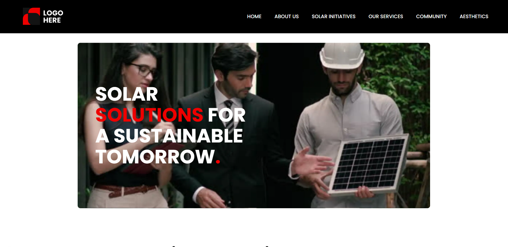

# :sunny: Solar-Solutions - лендинг для компании по продаже солнечных батарей



## :book: Описание

Проект представляет собой современный веб-сайт для компании, занимающейся продажей и установкой солнечных батарей, а также предоставляющей сопутствующие услуги (кабельное ТВ, интернет, телефонные услуги).

## :hammer_and_wrench: Стек технологий

- **Next.js 16** - React-фреймворк с SSR-подходом и App Router
- **React** - библиотека для создания пользовательских интерфейсов
- **TypeScript** - Статическая типизации
- **Tailwind 4.1** - CSS-фреймворк для быстрой стилизации
- **Framer-motion** - Библиотека для анимаций
- **Bun** - Современный и быстрый пакетный менеджер

## :rocket: Установка и запуск

1. Клонировать репозиторий:

   ```bash
   git clone https://github.com/Niko142/Solar-Solutions-App.git
   cd Solar-Solutions-App
   ```

2. Установить зависимости:

   ```bash
   bun install
   ```

3. Запустить dev-сборку:

   ```bash
   bun run dev
   ```

4. Сборка для production:

   ```bash
   # Сборка production-версии проекта
   bun run build
   # Запуск production-сборки
   bun run start
   ```

## :white_check_mark: Особенности проекта

- **Компонентный подход:** Разбиение интерфейса на модульные компоненты
- **TypeScript:** Полная типизация для надежности кода
- **Анимации:** Плавные интерактивные анимации на базе библиотеки `framer-motion`, обеспечивающие необходимый UI/UX эффект
- **Адаптивный дизайн:** Корректное отображение на всех типах устройств
- **Статическая генерация:** Использование возможностей Next.js для оптимизированной сборки и более комфортной маршрутизации
- **Декомпозиция компонентов:** Четкое разделение ответственности между компонентами

## :file_folder: Структура

```text
Solar-Solutions-App
├── README.md
├── src
│   ├── app
│   │   ├── (routes)
│   │   └── layout.tsx
│   ├── assets
│   │   └── globals.css
│   ├── components
│   │   ├── footer
│   │   ├── header
│   │   ├── layout
│   │   ├── sections
│   │   └── ui
│   ├── constants
│   │   ├── animations
│   │   ├── data
│   │   └── footer-texts.ts
│   ├── hooks
│   │   └── useClickOutside.ts
│   └── types
│       ├── common.types.ts
│       ├── contact.types.ts
│       ├── navigation.types.ts
│       ├── offerings.types.ts
│       └── theme.types.ts
```

## :link: Ссылки

[Демо-версия](https://niko142.github.io/Solar-Solutions-App/)

[Макет в Figma](<https://www.figma.com/design/IM6Mm8u7VNCWlduJIjiWtY/website-design---solar-solution---corporate-(Community)?node-id=0-1&t=0s9AeR5hC2aiXlPh-1>)
